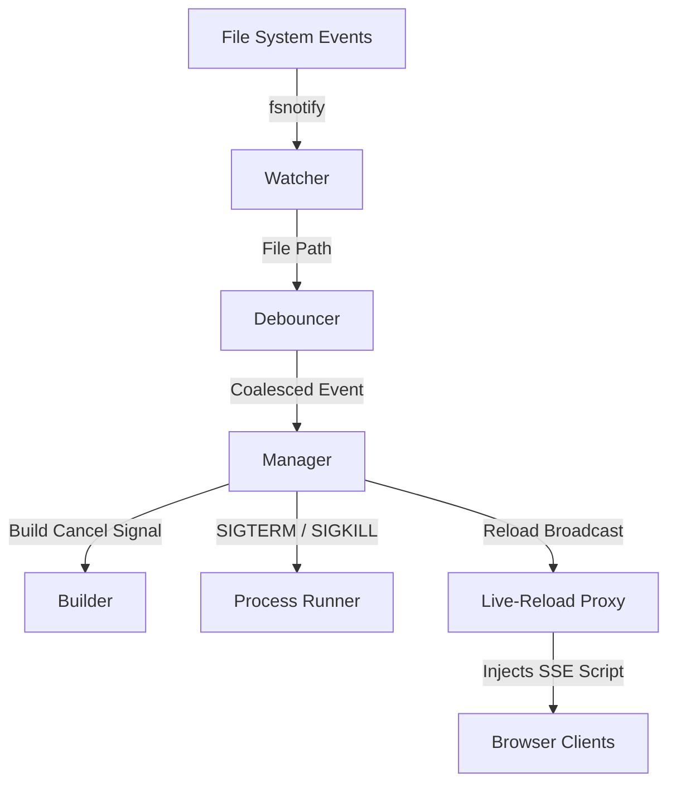

# 🔥 Hotreload CLI

> A high-performance, cross-platform CLI tool in Go that watches your project files, automatically rebuilds and restarts your application, and injects a real-time live-reload script into your web browser.

[](https://github.com/shravansumanthanan/hot-reload-engine-go/actions/workflows/ci.yml)
[](https://github.com/shravansumanthanan/hot-reload-engine-go)
[](https://github.com/shravansumanthanan/hot-reload-engine-go/releases)
[](LICENSE)

---

## Why This Exists

During local development, manually stopping your server, compiling your changes, and refreshing your browser is a friction-filled flow. Typical file watchers often fail in key areas:
- **Orphaned Processes:** They kill the main process but leave child processes running, causing "address already in use" errors on the next build.
- **Resource Exhaustion:** Rapidly saving files causes a storm of concurrent, overlapping compiles that freeze the CPU.
- **Crash Loops:** If the app has an initialization bug, the watcher restarts it continuously in an infinite crash loop, spiking machine temperatures.

`hotreload` is designed specifically to solve these operational pain points. It guarantees complete process group teardown, provides race-free build cancellation, coalesces rapid events, and protects system resources with a jittered exponential backoff crash-monitor.

---

## How It Works (Architecture)



1. **Watcher:** Monitor directories recursively using OS-native events, ignoring editor swap files and dependencies.
2. **Debouncer:** Coalesce rapid, consecutive file saves into a single build trigger.
3. **Manager:** Oversee the build and runner loops. When a new trigger arrives during a build, the active compile is cancelled immediately.
4. **Runner:** Launch the application in its own process group. It uses platform-specific system calls to guarantee that child processes are completely torn down before any rebuild.
5. **Proxy:** Inject an SSE (Server-Sent Events) live-reload script into HTML content, proxying standard requests to the application and automatically refreshing open browser tabs when a rebuild completes.

---

## Quick Start

You can get `hotreload` running on your local machine in under a minute.

### 1. Install

```bash
go install github.com/shravansumanthanan/hot-reload-engine-go@latest
```

### 2. Configure Your Project

Initialize a configuration file in your project's root:

```bash
hotreload --init
```

This creates a `.hotreload.yaml` file. Edit it to specify your build and run commands:

```yaml
root: .
build: "go build -o ./bin/server main.go"
exec: "./bin/server"
extensions:
  - .go
  - .yaml
ignore:
  - tmp
  - vendor
proxy: "8080:8081"
```

### 3. Run

```bash
hotreload
```

---

## Features

- **⚡ Instant Interruption:** If you save a file while a build is running, `hotreload` immediately cancels the ongoing compiler process and schedules a fresh build.
- **🛑 Zero Zombie Processes:** Restarts terminate the entire process group (PGID) using graceful `SIGTERM` followed by a `SIGKILL` timeout. On Windows, it handles process tree cleanup via `taskkill`.
- **⏱️ Timed Debouncing:** File saves within `100ms` of each other are coalesced into a single rebuild event to prevent unnecessary CPU usage.
- **💥 Crash Loop Backoff:** If your app panics or crashes instantly on boot, `hotreload` uses exponential backoff with jitter to delay restarts, protecting your CPU.
- **🌐 Live-Reload Proxy:** Serves as a transparent reverse proxy that injects a light SSE script into your HTML responses, reloading your browser page whenever a backend build succeeds.
- **📁 Dynamic Directory Watching:** Automatically detects newly created folders during runtime and registers them with the watcher.

---

## Installation

### Prerequisites
- **Go:** 1.22+ (verified on Go 1.22, 1.23, and 1.24)
- **Make:** Optional, for building from source or running demos

### From Source

```bash
git clone https://github.com/shravansumanthanan/hot-reload-engine-go.git
cd hot-reload-engine-go
make build
```

The compiled binary will be placed at `./hotreload`.

---

## Configuration Reference

### `.hotreload.yaml`

The configuration file is automatically loaded from the current directory if present.

| Key | Type | Default | Description |
|---|---|---|---|
| `root` | `string` | `.` | The project directory root to monitor. |
| `build` | `string` | `""` | Command to build/compile your application. |
| `exec` | `string` | `""` | Command to start your application binary. |
| `extensions` | `[]string` | `[.go]` | File extensions that trigger a reload. |
| `ignore` | `[]string` | `[]` | Extra directories to exclude from monitoring. |
| `proxy` | `string` | `""` | Proxy ports formatted as `<proxy_port>:<app_port>` (e.g., `8080:8081`). |
| `log_level` | `string` | `debug` | Logging verbosity: `debug`, `info`, `warn`, `error`. |

### `.hotreloadignore`

You can exclude specific folders or files from triggering reloads by creating a `.hotreloadignore` file in your root folder. Lines starting with `#` are ignored.

```text
# Exclude testing outputs and docs
bin/
docs/
*.tmp
vendor/
```

### CLI Flags

CLI flags override settings specified in `.hotreload.yaml`.

```bash
# Example overrides:
hotreload --root ./web --build "go build -o app" --exec "./app" --log-level info
```

- `--root` (string): Project root directory to watch.
- `--build` (string): Command to compile the project.
- `--exec` (string): Command to execute the built binary.
- `--ext` (string): Comma-separated list of file extensions to watch.
- `--ignore` (string): Comma-separated list of directories to ignore.
- `--proxy` (string): Live-reload proxy port map (e.g., `8080:8081`).
- `--log-level` (string): Log level (`debug`, `info`, `warn`, `error`).
- `--config` (string): Path to configuration file (default: `.hotreload.yaml`).
- `--init` (bool): Generate an example `.hotreload.yaml` configuration file.
- `--version` (bool): Print version and exit.

---

## Demos & Testing

The repository includes a sample `testserver` which you can use to experiment with all features.

### Run the standard reload demo:
```bash
make demo
```
This builds `hotreload`, runs the test server on port `8081`, and mounts the proxy on port `8080`.
1. Open your browser to `http://localhost:8080`.
2. Edit `./testserver/main.go` (e.g., change the text in the response or logs).
3. Save the file.
4. **Observe:** The server rebuilds, restarts, and the browser page refreshes automatically!

### Run the crash loop demo:
```bash
make demo-crash
```
This runs the test server in crash-mode, causing it to exit immediately on startup.
- **Observe:** `hotreload` detects the rapid crash cycle, throttles the CPU load by applying an exponential backoff delay, and prints status logs tracking the current backoff delay.

---

## Contributing

See [CONTRIBUTING.md](CONTRIBUTING.md) for details on code style, testing guidelines, and submission workflows.

To run tests with the Go race detector:
```bash
make test-race
```

---

## License

This project is licensed under the MIT License - see the [LICENSE](LICENSE) file for details.
