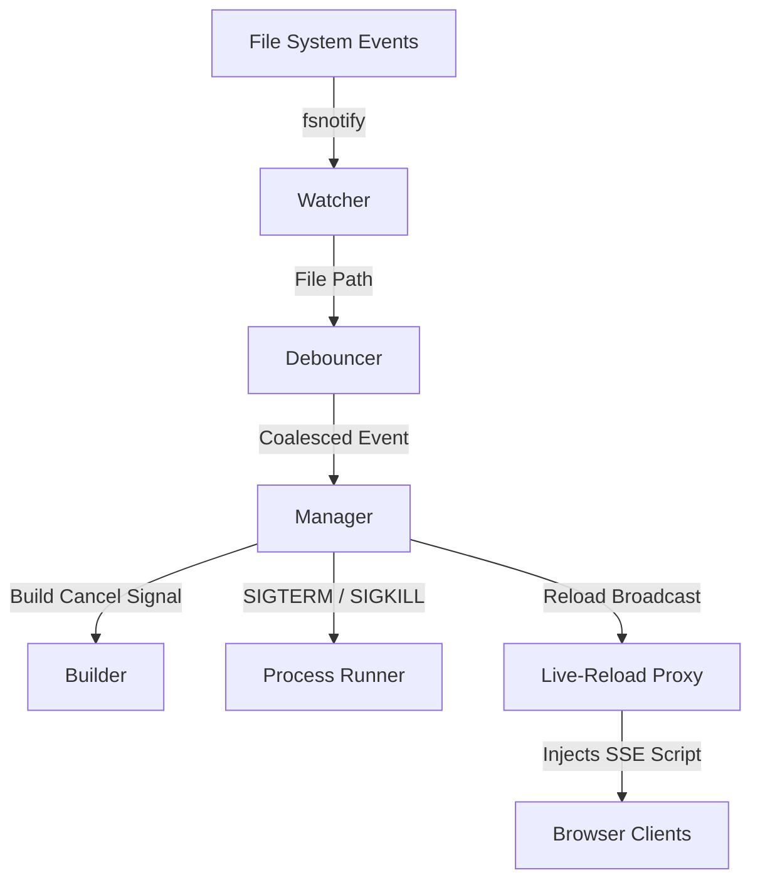

<div align="center">

# 🔥 hotreload

### **Zero-friction live reload for any Go project — and beyond.**

*Stop. Compile. Restart. Refresh. Repeat.*  
*Never again.*

<br/>

[](https://github.com/shravansumanthanan/hot-reload-engine-go/actions/workflows/ci.yml)
[](https://github.com/shravansumanthanan/hot-reload-engine-go)
[](https://github.com/shravansumanthanan/hot-reload-engine-go/releases)
[](https://goreportcard.com/report/github.com/shravansumanthanan/hot-reload-engine-go)
[](https://pkg.go.dev/github.com/shravansumanthanan/hot-reload-engine-go)
[](LICENSE)
[](https://github.com/shravansumanthanan/hot-reload-engine-go/stargazers)

<br/>

<!-- demo gif here — record with vhs or asciinema and drop it in /docs/demo.gif -->

**[Quick Start](#-quick-start) · [Features](#-features) · [Configuration](#-configuration-reference) · [Architecture](#%EF%B8%8F-how-it-works) · [Contributing](#-contributing)**

</div>

---

## The Problem Every Developer Knows

You make a one-line change. Now the ritual begins:

```
Ctrl+C → go build → ./server → Alt+Tab → F5
```

Do that 50 times a day and you've lost hours to mechanical repetition. Existing tools help — but each one has rough edges that bite you in real projects:

| Pain Point | What you hit in practice | `hotreload` |
|---|---|:---:|
| **Orphaned child processes** ("address already in use") | Happens with most watchers when the app spawns sub-processes | ✅ Full PGID teardown |
| **CPU storms from rapid saves** | Editor auto-saves fire dozens of events per second | ✅ 100ms debounce |
| **Infinite crash loops spiking your CPU** | No watcher except `hotreload` throttles rapid crash cycles | ✅ Exponential backoff + jitter |
| **Browser refresh fires before server is ready** | Fixed sleep-based approaches miss slow-starting apps | ✅ HTTP/TCP readiness probe |
| **Mid-build saves start a stale build** | Some tools wait for the current build to finish | ✅ Instant build cancellation |
| **Only works with Go** | Many Go-focused tools can't run `npm run build` or `uvicorn` | ✅ Any shell command |

> `hotreload` was built to close the gaps that accumulate over years of Go development — particularly crash-loop CPU saturation and stale browser reloads after partial app startup.

---

## ⚡ Quick Start

Get running in under 60 seconds.

### Install

```bash
go install github.com/shravansumanthanan/hot-reload-engine-go@latest
```

Or build from source:

```bash
git clone https://github.com/shravansumanthanan/hot-reload-engine-go.git
cd hot-reload-engine-go
make build
```

### Initialize & Run

```bash
# 1. Drop a config file in your project root
hotreload --init

# 2. That's it. Start the loop.
hotreload
```

`--init` generates a `.hotreload.yaml` pre-filled with sensible defaults. Edit it once, never again.

---

## 🚀 Real-World Use Cases

### Go Web Server (Default)

```yaml
# .hotreload.yaml
root: .
build: "go build -o ./bin/server ./cmd/server"
exec: "./bin/server"
extensions: [.go, .yaml, .html, .tmpl]
ignore: [vendor, node_modules, .git]
proxy: "8080:8081"
```

Open `http://localhost:8080` — every save auto-reloads the page. No browser extension needed.

---

### Node.js / TypeScript

```yaml
root: .
build: "npm run build"
exec: "node dist/index.js"
extensions: [.ts, .js, .json]
ignore: [node_modules, dist]
```

---

### Python (FastAPI / Flask)

```yaml
root: .
build: ""           # no build step needed
exec: "uvicorn main:app --port 8081"
extensions: [.py, .env]
ignore: [__pycache__, .venv]
proxy: "8080:8081"
```

---

### Rust

```yaml
root: .
build: "cargo build"
exec: "./target/debug/myapp"
extensions: [.rs, .toml]
ignore: [target]
```

---

### Any Language, Any Command

`hotreload` doesn't care what you're building. If it can be expressed as a shell command, it works.

---

## ✨ Features

<table>
<tr>
<td width="50%">

### ⚡ Instant Build Cancellation
Save a file mid-compile? The active compiler process is **cancelled immediately** — no waiting for a stale build to finish before starting the fresh one.

</td>
<td width="50%">

### 🛑 Zero Zombie Processes
Every restart terminates the **entire process group** (PGID) — graceful `SIGTERM` first, then `SIGKILL` on timeout. Windows gets `taskkill /T`. No orphans. Ever.

</td>
</tr>
<tr>
<td width="50%">

### ⏱️ Timed Debouncing
Rapid saves within `100ms` are **coalesced into a single trigger**. Your CPU won't melt just because your editor auto-saves aggressively.

</td>
<td width="50%">

### 💥 Crash Loop Backoff
App panicking on boot? `hotreload` applies **exponential backoff with jitter** so a broken startup doesn't turn into a CPU heater. It throttles automatically and recovers gracefully.

</td>
</tr>
<tr>
<td width="50%">

### 🌐 Live-Reload Proxy
Acts as a **transparent reverse proxy** that injects a tiny SSE script into HTML responses. Your browser tab reloads the moment a build succeeds — no browser extension, no manual refresh.

</td>
<td width="50%">

### 📁 Dynamic Directory Watching
New folders created at runtime are **automatically registered** with the file watcher. You'll never miss an event from a directory that didn't exist when the process started.

</td>
</tr>
<tr>
<td width="50%">

### 🔧 Pre & Post Build Hooks *(v0.2.0)*
Run arbitrary commands **before and after** each build cycle — lint, codegen, asset bundling, database migrations. Compose your full dev workflow into a single watcher.

</td>
<td width="50%">

### 📦 Embeddable as a Library *(v0.2.0)*
Import `hotreload` as a Go package to wire live-reload directly into your **own CLI tools or dev servers** — no external binary required.

</td>
</tr>
</table>

---

## 🏗️ How It Works



### What Makes This Different

Most file-watchers are a thin shell around `fsnotify` and `os.exec`. `hotreload` is designed from first principles around **operational correctness**:

1. **Watcher** — Monitors directories recursively via OS-native events, skipping editor swap files (`.swp`, `~`) and dependency folders.
2. **Debouncer** — A timer-based coalescer ensures that 20 saves in 50ms become exactly one build trigger.
3. **Manager** — The central coordinator. An incoming trigger during an active build propagates a `context.CancelFunc` to the compiler goroutine — *not* a `SIGKILL` to the process — making cancellation race-free at the Go level.
4. **Runner** — Spawns the application in its own **process group**. On UNIX this means `Setpgid: true` + `syscall.Kill(-pgid, ...)` — every child inherits the group and is torn down atomically. No port conflicts on the next start.
5. **Proxy** — An `httputil.ReverseProxy` intercepts responses, and for `text/html` content it streams in a 200-byte SSE script. The script opens an `EventSource` to the proxy; on rebuild, the proxy fires a `reload` event and the browser acts immediately.

The result: a feedback loop that is **deterministic, resource-safe, and browser-aware** without requiring any external daemon or browser plugin.

---

## 📦 Configuration Reference

### `.hotreload.yaml`

```yaml
root: .
build: "go build -o ./bin/server ./cmd/server"
exec: "./bin/server"
extensions:
  - .go
  - .yaml
ignore:
  - tmp
  - vendor
proxy: "8080:8081"
log_level: info
```

| Key | Type | Default | Description |
|---|---|---|---|
| `root` | `string` | `.` | Project directory root to monitor |
| `build` | `string` | `""` | Shell command to compile your application |
| `exec` | `string` | `""` | Shell command to start your binary |
| `extensions` | `[]string` | `[.go]` | Extensions that trigger a rebuild |
| `ignore` | `[]string` | `[]` | Directories / globs to exclude |
| `proxy` | `string` | `""` | `<proxy_port>:<app_port>` for live-reload |
| `log_level` | `string` | `debug` | `debug` · `info` · `warn` · `error` |

### `.hotreloadignore`

Works like `.gitignore` — one pattern per line, `#` for comments:

```
# build artifacts and generated files
bin/
dist/
*.tmp
vendor/
__pycache__/
node_modules/
```

### CLI Flags

All flags override their `.hotreload.yaml` equivalents.

```
--root         string   Project root directory to watch
--build        string   Command to compile the project
--exec         string   Command to execute the binary
--ext          string   Comma-separated file extensions to watch
--ignore       string   Comma-separated directories to ignore
--proxy        string   Live-reload proxy map (e.g. 8080:8081)
--log-level    string   Log verbosity (debug|info|warn|error)
--config       string   Path to config file (default: .hotreload.yaml)
--init                  Generate an example .hotreload.yaml
--version               Print version and exit
```

---

## 🧪 Demos & Testing

The repo ships a `testserver` so you can see every feature working in under 2 minutes.

### Interactive live-reload demo

```bash
make demo
```

1. Open `http://localhost:8080` in your browser.
2. Edit `./testserver/main.go` — change a string, save.
3. Watch the terminal compile and the browser tab refresh automatically.

### Crash-loop backoff demo

```bash
make demo-crash
```

The test server exits immediately on startup. Watch `hotreload` detect the crash cycle, apply jittered backoff, and print the growing delay between retries — all without pegging the CPU.

### Run tests with the race detector

```bash
make test-race
```

---

## 🏁 Comparison vs. Alternatives

A focused look at the features where tools meaningfully differ.

| Feature | `hotreload` | [air](https://github.com/air-verse/air) | [realize](https://github.com/oxequa/realize) | nodemon |
|---|:---:|:---:|:---:|:---:|
| Process group teardown (no orphan ports) | ✅ PGID kill | ⚠️ Partial | ⚠️ Partial | ⚠️ Partial |
| Mid-build cancellation | ✅ | ✅ | ❌ | ❌ |
| Crash-loop backoff + jitter | ✅ | ❌ | ❌ | ❌ |
| Live-reload proxy | ✅ Always-on, zero-config | ⚠️ Opt-in, requires `[proxy]` config | ❌ | ❌ |
| Browser reload timing | ✅ HTTP/TCP readiness probe | ❌ Fires immediately after exec | ❌ | ❌ |
| Gzip HTML injection | ✅ | ❌ | ❌ | ❌ |
| Language-agnostic (Node, Python, Rust…) | ✅ Any shell command | ⚠️ Go-focused by design | ⚠️ Go-focused | ✅ Node only |
| Embeddable as a library | ✅ | ❌ | ❌ | ❌ |
| Pre / post build hooks | ✅ | ✅ | ✅ | ❌ |
| `.env` file auto-loading | ❌ | ✅ | ❌ | ❌ |
| Platform-specific build config | ❌ | ✅ `[build.windows]` | ❌ | ❌ |
| Debugger (`dlv`) entrypoint support | ❌ | ✅ | ❌ | ❌ |
| Docker image / Homebrew tap | ❌ | ✅ | ❌ | ✅ |

> **Where `hotreload` leads**: crash-loop safety, proxy readiness, and gzip HTML injection.  
> **Where `air` leads**: ecosystem maturity, `.env` loading, debugger integration, and Docker packaging.

---

## 🤝 Contributing

Contributions are very welcome — whether it's a bug report, a feature idea, or a pull request.

**New to the project?** Start here:
- 🐛 Browse [`good first issue`](https://github.com/shravansumanthanan/hot-reload-engine-go/issues?q=is%3Aissue+is%3Aopen+label%3A%22good+first+issue%22) issues — they're specifically scoped for first-time contributors.
- 💬 Start or join a [Discussion](https://github.com/shravansumanthanan/hot-reload-engine-go/discussions) if you have a design question or want to propose something bigger.

**Before submitting a PR:**

```bash
# Run the full test suite with the race detector
make test-race

# Ensure code is formatted
gofmt -w .
```

See [CONTRIBUTING.md](CONTRIBUTING.md) for code style, branch conventions, and review guidelines.

---

## 🌟 Show Your Support

If `hotreload` saves you time or frustration, the best way to support it is a ⭐ — it helps other developers discover the project.

[](https://github.com/shravansumanthanan/hot-reload-engine-go/stargazers)

---

## 📄 License

MIT © [Shravan Sumanthanan](https://github.com/shravansumanthanan) — see [LICENSE](LICENSE) for details.

---

<div align="center">

**Keywords:** `go live reload` · `hot reload go` · `file watcher cli` · `go devtools` · `go hot reload server` · `golang watch rebuild` · `live reload proxy` · `go development workflow` · `go air alternative` · `auto restart go server`

</div>
